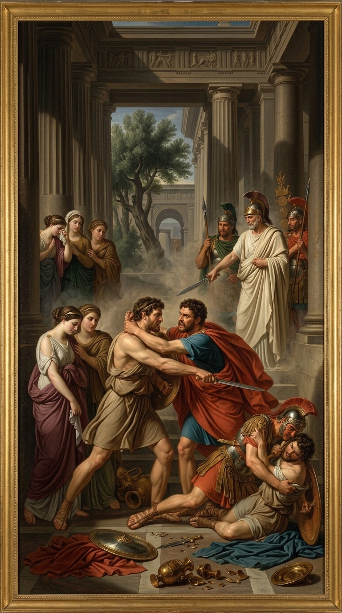

<table>
<tr>

<td width="35%" valign="top" align="center">
    
</td>

<td width="65%" valign="top">

<pre>
<strong>Nofil@GitHub</strong>
--------------------------------------------------------------

OS: ............................ Windows 11
Education: ..................... BS Computer Science
University: .................... University of Karachi
IDE: ........................... VS Code

Languages.Programming: ......... Java, Python, JavaScript, TypeScript, C++
Languages.Web: ................. React, Next.js, Node.js, Express
Languages.Database: ............ MongoDB, PostgreSQL, Prisma
Languages.DevOps: .............. Docker, Railway, Vercel, GitHub Actions

Currently Learning: ........... AI Agents, System Design,
                              
--------------------------------------------------------------
Contact
--------------------------------------------------------------

Email: ........................ your@email.com
LinkedIn: ..................... linkedin.com/in/yourprofile
Portfolio: .................... coming soon

--------------------------------------------------------------
GitHub Stats
--------------------------------------------------------------

Repos: ............ 20+
Projects: ......... UBIT-LMS | Financial Analysis | AI Agents
Focus: ............ Full-Stack Development & AI
Open Source: ...... Always Learning!
</pre>

</td>

</tr>
</table>